# keycloak-workshop
Keycloak workshop @JBCNConf'2022

## 1. pre-requisites
For the backend;
+ JDK 11+
+ Keycloak 18 : download and extract keycloak binary from https://github.com/keycloak/keycloak/releases/download/18.0.2/keycloak-18.0.2.zip
+ Postman
+ basic knowledge on Java development
+ basic knowledge on Maven  
+ basic knowledge on Spring security

For the frontend;
+ npm version 8+
+ node version 16+
+ basic knowledge on building and running vue.js app with npm

For **optional** github authentication;
+ create an OAuth application on your github account
+ goto github.com / Settings / Developer settings / OAuth Apps
+ click New OAuth App and enter following values
  + Application name : keycloak-oauth
  + Homepage URL : http://localhost:8080
  + Authorization callback URL : http://localhost:8080/realms/ldap-demo/broker/github/endpoint
  + click `Register application` button
  + make sure that you copy / paste the client ID and client secret values aside.


in the github repository following modules are provided

+ ldap-server : embedded ldap server module, used to start an ldap server instance
+ backend-spring-boot : spring boot backend module, used to secure REST APIs 
+ frontend-vuejs : vue.js frontend module, used to secure UI application

## 2. embedded ldap server
ldap-server module is provided to start an ldap server for demonstration purposes. in the scope of this workshop we will use ldap server for authenticating users.

follow the steps to start and verify the ldap server
+ open ldap-server module as a maven project
+ run LdapServerApplication.java as a Spring boot application

there are couple of ways to run LdapServerApplication.java as a Spring boot application
#### run from your IDE


#### run with maven wrapper 
run following command from the ldap-server folder
```
cd ldap-server
./mvnw spring-boot:run
```

### verify ldap server
verify that the ldap server is running by requesting following URL
+ http://localhost:8090/ldap/get-users

```
[
	{
		"userId": "bwilson",
		"fullName": "Bruce",
		"lastName": "Wilson",
		"description": null
	},
	{
		"userId": "jbrown",
		"fullName": "James",
		"lastName": "Brown",
		"description": null
	}
]
```

### details about the ldap server 
#### pom.xml
following dependencies are important for booting the embedded ldap server

```
        <dependency>
            <groupId>com.unboundid</groupId>
            <artifactId>unboundid-ldapsdk</artifactId>
        </dependency>

        <dependency>
            <groupId>org.springframework.boot</groupId>
            <artifactId>spring-boot-starter-data-ldap</artifactId>
        </dependency>
```

#### application.properties
embedded ldap server is configured via the configuration items in the application.properties file e.g. bind username/password, ldap server port, .ldif file as the source of directory repository 
```
spring.ldap.embedded.base-dn=dc=keycloak,dc=org
spring.ldap.embedded.credential.username=uid=admin,ou=system
spring.ldap.embedded.credential.password=secret
spring.ldap.embedded.ldif=classpath:ldap-example-users.ldif
spring.ldap.embedded.port=10389
spring.ldap.embedded.validation.enabled=false
```

#### ldap-example-users.ldif
this file is used to specify 
+ organization structure
+ groups
+ users
+ etc. 

a person (user) is defined as follows
```
dn: uid=jbrown,ou=People,dc=keycloak,dc=org
objectclass: top
objectclass: person
objectclass: organizationalPerson
objectclass: inetOrgPerson
uid: jbrown
cn: James
sn: Brown
mail: jbrown@keycloak.org
postalCode: 88441
userPassword: password
```

a user group and its members are defined as follows
```
dn: cn=normalUsers,ou=UserRoles,dc=keycloak,dc=org
objectclass: top
objectclass: groupOfNames
cn: normalUsers
member: uid=jbrown,ou=People,dc=keycloak,dc=org
member: cn=superUsers,ou=UserRoles,dc=keycloak,dc=org
```

## 3. keycloak server
let's start and configure the keycloak server for identity management solution
### download keycloak server
download and unzip keycloak server from following url : https://github.com/keycloak/keycloak/releases/download/18.0.2/keycloak-18.0.2.zip

### start keycloak server
run the following command from the folder keycloak-18.0.2
on Mac / Linux 
```
./bin/kc.sh start-dev
```
on Windows
```
.\bin\kc.bat start-dev
```

if keycloak server starts successfully, you should see similar output as follows

```
...
2022-07-14 23:34:31,314 INFO  [io.quarkus] (main) Keycloak 18.0.2 on JVM (powered by Quarkus 2.7.5.Final) started in 17.136s. Listening on: http://0.0.0.0:8080
...
2022-07-14 23:34:31,325 WARN  [org.keycloak.quarkus.runtime.KeycloakMain] (main) Running the server in development mode. DO NOT use this configuration in production.
```


### configure keycloak admin account
open the keycloak administration console. 
http://localhost:8080/

On the first run, you have to specify an admin user and password

enter following values and click Create
+ Username : admin
+ Password : secret
+ Password confirmation : secret

after creating the admin user, click on Administration Console 

enter admin / secret as username and password

you should see the Master realms settings page


### configure ldap-demo realm
Keycloak uses the concept of realms as multi tenants. we should create a realm in order to provide any kind of identity management operations. 
There are two ways to create a realm
1. create from scratch
2. import from existing realm configuration file ```keycloak-config/ldaprealm.json```

#### alternative 1. create ldap-demo realm from scratch
+ click ```Add realm``` button which is on the dropdown listing the realms to the top left part of the page
+ 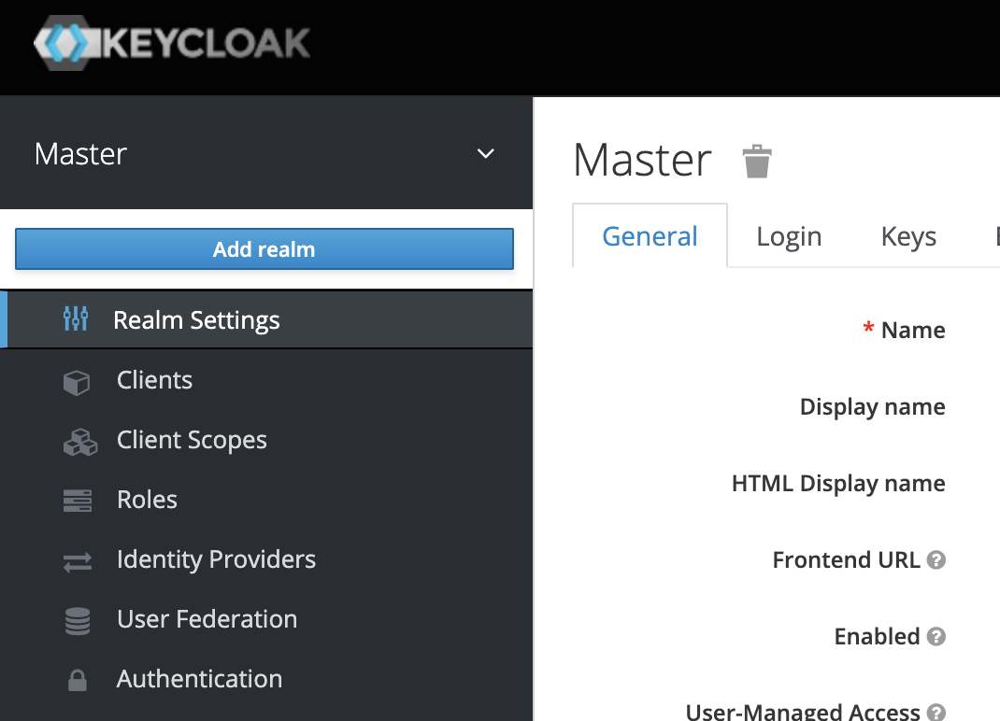
+ enter name : ```ldap-demo```
+ click ```Create``` button
+ you should have ```ldap-demo``` created 

now we need a user federation to integrate with our previously activated embedded ldap server
+ from the left navigation pane, clict ```User federation``` and from the ```Add provider``` drop down, click ```ldap``` 
+ this will create an empty ldap provider, fill in the following fields with provided values. the values correspond to ```ldap-example-users.ldif```  and ```application.properties``` files in ldap-server module
  + Console display name : ldap-embedded-server
  + Edit mode : WRITABLE
  + Vendor : Other
  + Username LDAP attribute : uid
  + RDN LDAP attribute : uid
  + UUID LDAP attribute : entryUUID
  + User Object Classes : inetOrgPerson, organizationalPerson
  + Connection URL : ldap://localhost:10389
  + Users DN : ou=People,dc=keycloak,dc=org
  + Bind Type : simple
  + Bind DN : uid=admin,ou=system
  + Bind Credential : secret
+ after filling in the form, test the ldap url and binding by clicking ```Test connection``` and ```Test authentication``` buttons. you should see green success messages 
+ click Save button at the end of the page 

#### alternative 2. import ldap-demo realm from json file
+ click ```Add realm``` button
+ select  [ldaprealm.json](keycloak-config/ldaprealm.json) file
+ set realm name : ldap-demo
+ see schreen shot 
+ click ```Create``` button 
+ you should have ```ldap-demo``` imported 
+ this action will also import a previously configured ldap user federation. click ```User federation``` from the left navigation pane and see the embedded ldap server configuration 
+ click on ```ldap-embedded-server```, verfiy the values, click on ```Test connection``` and ```Test authentication``` buttons and scroll down to the bottom of the page

#### synchronize all the users from ldap-server
+ after either creating or importing our ldap-realm, we can synchronize all the users from the ldap server to keycloak
+ you should see blue buttons at the bottom of the page, click on ```Synchronize all users button``` and you should see a message saying that two users were successfully imported from ldap server 
+ verify the users by going to ```Users``` page and ```view all users``` 

### verify user authentication from ldap 
now that we have a realm and user federation configured, we should be able to perform username / password authentication which will authenticate the user credentials from our embedded ldap server. 
Keycloak provides predefined account client which provides a web application for testing authentication methods and checking user details. 
+ click on ```Clients``` from the left navigation pane 
+ click on http://localhost:8080/realms/ldap-demo/account/ link which will open a new tab and show the account web application
+ click on ```Sign in``` button on the top right corner
+ enter user credentials
  + username : bwilson
  + password : password 
+ 
+ click ```Sign in``` and you should see the account details page  
+ this indicates that the whole integration between keycloak and ldap server works perfectly
+ you can navigate to `Personal Info`, `Account Security`, `Applications` pages
+ also, you can go back to keycloak admin console and see the session for the user who has just authenticated from the Sessions link 

### verify realm openid-connect configuration
+ click `Realm Settings` from left navigation pane
+ click `OpenID Endpoint Configuration` link which will open a new tab with the available URLs and configuration parameters
+ http://localhost:8080/realms/ldap-demo/.well-known/openid-configuration 
+ pay attention to some of the important parameters
  + token_endpoint
  + jwks_uri
  + grant_types_supported
  + etc.
+ 
+ 

### demo-client  
Keycloak uses the concept of clients for providing different authentication and authorization methods for different applications. In the previous section, we have already seen a predefined client `account` for verifying ldap authentication. 

#### create demo-client
We should create custom clients for different applications. in the scope of this workshop, we will create a client called `demo-client`.
+ click `Clients` from the left navigation pane
+ click `Create` button on the top right corner of the table and provide following values
  + Client ID : demo-client
  + Client protocol : openid-connect
  + Root URL : http://localhost:3000/
+ click `Save` button 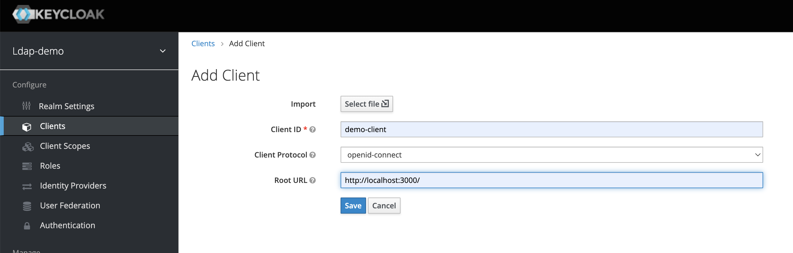
+ you can leave the default values on the next page.

#### verify username / password authentication for demo-client
now we can try to authenticate via our demo-client and the same ldap username / password credentials. 

for this purpose we have provided a Postman collection [Keycloak Workshop.postman_collection.json](Keycloak%20Workshop.postman_collection.json). we can use Postman to send a POST request to the keycloak server for authentication. 

+ open Postman and import the collection provided. then you will have the required HTTP requests
+ 

+ pay attention to the url which is the `token_endpoint` provided in the `demo-client` openid connect configuration parameters
```
curl --location --request POST 'http://localhost:8080/realms/ldap-demo/protocol/openid-connect/token' \
--header 'Content-Type: application/x-www-form-urlencoded' \
--data-urlencode 'client_id=demo-client' \
--data-urlencode 'grant_type=password'
--data-urlencode 'username=bwilson' \
--data-urlencode 'password=password' \
```

as the response, we should get similar JSON data including an `access_token`, `refresh_token`, etc. access_token will be saved to an environment variable for future calls to baclkend services 
```
{
    "access_token": "eyJhbGciOiJSUzI1NiIsInR5cCIgOiAiSldUIiwia2lkIiA6ICItUDFDRklXb0ZCckhNa1NhNnFZbTJtb0tpWnFUUW10ZW41Mmx1RjFpamZ3In0.eyJleHAiOjE2NTc5NjgwMzQsImlhdCI6MTY1Nzk2NzczNCwianRpIjoiYzdkMzMyOTEtNGU4OS00NGQ3LThjNWYtYWVhNmMxMmUwNzRmIiwiaXNzIjoiaHR0cDovL2xvY2FsaG9zdDo4MDgwL3JlYWxtcy9sZGFwLWRlbW8iLCJhdWQiOiJhY2NvdW50Iiwic3ViIjoiNDA5NTY3MDItMTE3Zi00NzJjLWE4ZWQtOTE4MmQ2OGQyYjE1IiwidHlwIjoiQmVhcmVyIiwiYXpwIjoiZGVtby1jbGllbnQiLCJzZXNzaW9uX3N0YXRlIjoiOGM4MzBlYjYtNjU3Yy00ZTQ1LTk1ODctMWU0YTIwMGY4MDMwIiwiYWNyIjoiMSIsImFsbG93ZWQtb3JpZ2lucyI6WyJodHRwOi8vbG9jYWxob3N0OjMwMDAiXSwicmVhbG1fYWNjZXNzIjp7InJvbGVzIjpbIm9mZmxpbmVfYWNjZXNzIiwiZGVmYXVsdC1yb2xlcy1sZGFwLWRlbW8iLCJ1bWFfYXV0aG9yaXphdGlvbiJdfSwicmVzb3VyY2VfYWNjZXNzIjp7ImFjY291bnQiOnsicm9sZXMiOlsibWFuYWdlLWFjY291bnQiLCJtYW5hZ2UtYWNjb3VudC1saW5rcyIsInZpZXctcHJvZmlsZSJdfX0sInNjb3BlIjoiZW1haWwgcHJvZmlsZSIsInNpZCI6IjhjODMwZWI2LTY1N2MtNGU0NS05NTg3LTFlNGEyMDBmODAzMCIsImVtYWlsX3ZlcmlmaWVkIjpmYWxzZSwibmFtZSI6IkJydWNlIFdpbHNvbiIsInByZWZlcnJlZF91c2VybmFtZSI6ImJ3aWxzb24iLCJnaXZlbl9uYW1lIjoiQnJ1Y2UiLCJmYW1pbHlfbmFtZSI6IldpbHNvbiIsImVtYWlsIjoiYndpbHNvbkBrZXljbG9hay5vcmcifQ.DMoz8pOj-BjnLN-b7rDWtnbh0TCNTFi5Cm7StOwhsHRzbMeXkcurF538ySpxOyuQ44XJjnqy7Z6IhCn9uzWKvnrb5dexxzBJyI_adjRtXxKgPYLNew1hpqgTOA_H_VNhU6LDivp06Ob0X9Y1De4eQ2OI7M06buFjFbR1EH0QTeQ-1epB-scSqdmR1ExlN6XLnx7Zt1Qt_VU0j4SJuey7qy54NO-o2MA_eRF-7HAJDRZ4epYJpZriHYYcoWOLjJ8bfjjL9twIRsITNZKgKjMN0MRFnvgjyWoqrTkQU0l_RUck-wTDQMVKysQNfbS8Bi55J-P-h9aYNWW0xDv4iR26Uw",
    "expires_in": 300,
    "refresh_expires_in": 1800,
    "refresh_token": "eyJhbGciOiJIUzI1NiIsInR5cCIgOiAiSldUIiwia2lkIiA6ICI5YWYwYjdiZi0zNGM5LTQwYTQtYWJjZi0xYmZhY2Q4OWNhY2UifQ.eyJleHAiOjE2NTc5Njk1MzQsImlhdCI6MTY1Nzk2NzczNCwianRpIjoiZGM4NjVhOTMtYzQzNC00NzUxLWI1ZTYtNjc0NDZlNDY3Yzk2IiwiaXNzIjoiaHR0cDovL2xvY2FsaG9zdDo4MDgwL3JlYWxtcy9sZGFwLWRlbW8iLCJhdWQiOiJodHRwOi8vbG9jYWxob3N0OjgwODAvcmVhbG1zL2xkYXAtZGVtbyIsInN1YiI6IjQwOTU2NzAyLTExN2YtNDcyYy1hOGVkLTkxODJkNjhkMmIxNSIsInR5cCI6IlJlZnJlc2giLCJhenAiOiJkZW1vLWNsaWVudCIsInNlc3Npb25fc3RhdGUiOiI4YzgzMGViNi02NTdjLTRlNDUtOTU4Ny0xZTRhMjAwZjgwMzAiLCJzY29wZSI6ImVtYWlsIHByb2ZpbGUiLCJzaWQiOiI4YzgzMGViNi02NTdjLTRlNDUtOTU4Ny0xZTRhMjAwZjgwMzAifQ.explD-3LX-bSnMpUIAkJbpNBxqnQGuxDZvUaqCDGzYE",
    "token_type": "Bearer",
    "not-before-policy": 0,
    "session_state": "8c830eb6-657c-4e45-9587-1e4a200f8030",
    "scope": "email profile"
}
```

go ahead and copy / paste the access token on the https://jwt.io page and see the content of the access token returned.

## 4. spring boot backend module

The main purpose of this workshop is to secure a backend application API services with the keycloak identity management capabilities. in the scope of this workshop we will have two roles and three API services with corresponding authorization rules

Roles :
1. NORMAL users
2. SUPER users

API services and authorization rules :
1. http://localhost:8070/demo/auth-token-info - all the users can call this service 
2. http://localhost:8070/demo/do-normal-things - NORMAL & SUPER users can call this service
3. http://localhost:8070/demo/do-super-things - ONLY SUPER users can call this service

for the sake of this workshop, we provide an incomplete backend module `backend-spring-boot`. please go ahead and import this as a module in your IDE. there are couple of TODOs in this module that are key to securing backend API services with keycloak functionality. 

### some important aspects about the backend module

#### pom.xml
following dependency is used to include spring security and JWT token decoding capabilities

```
        <dependency>
            <groupId>org.springframework.boot</groupId>
            <artifactId>spring-boot-starter-oauth2-resource-server</artifactId>
        </dependency>
```


#### JwtDecoderConfig.java
this configuration bean is used to initialize a JwtDecoder Spring bean for decoding only Keycloak generated valid JWT tokens. if a token is generated by the same keycloak instance but from a different realm, this bean will not decode the token successfully and an unauthorized exception (HHTP-401) will be thrown
```
@Configuration
public class JwtDecoderConfig {

	@Value("${spring.security.oauth2.resourceserver.jwt.jwk-set-uri}")
	String jwkSetUri;

	@Bean
	JwtDecoder jwtDecoder() {
		return NimbusJwtDecoder.withJwkSetUri(this.jwkSetUri).build();
	}

}
```

#### ApiSecurityContextRepository.java
this Spring bean is used to extract and decode the `Authorization` header value as the Keycloak generated `Bearer` access token. if the token is not valid or expired or does not exist at all, unauthorized (HTTP-401) response will be returned

pay attention to following methods 

loadContext is called before each API call to validate the token and get thre roles of the user from the valid token 
```
	@Override
	public SecurityContext loadContext(HttpRequestResponseHolder requestResponseHolder) {

	private AuthenticatedUser getAuthenticatedUserFromKeycLoakToken(String keycloakJwtToken) {
```


following methods are used to fetch the user roles provided by keycloak in the access token. there are two types of roles : realm roles, resource roles 
```
	private Set<String> getRealmRoles(Jwt jwtDecoded) {

	private Set<String> getResourceRoles(Jwt jwtDecoded, String clientName) {
```

### verify the backend service
go ahead and run the BackendSpringBootApplication.java and start the backend service. the backend service will start running but it'll return unauthorized (HTTP-401) for all the requests because the project has a few TODO items to be fixed for working properly. 

you can try to call the backend services from the Postman collection. All will return HTTP-401 even if you provide a valid access token. 
+ GET Auth details - just return the details of authenticated user
+ DO Super things - only SUPER users can call this service
+ DO Normal things - NORMAL and SUPER users can call this service

### TODO's to be fixed
in order to make backend serve correctly with the authorization requreiments couple of TODO's need to be fixed in backend module

#### 1. application.properties
`spring.security.oauth2.resourceserver.jwt.jwk-set-uri` parameter value needs to be fixed. Remember you can get this value from the following URL : http://localhost:8080/realms/ldap-demo/.well-known/openid-configuration

#### 2. ApiSecurityContextRepository.java
find the TODO in this class to make sure that the JWT access token provided by the client is decoded by the jwtDecoder bean which uses Keycloak jwks_uri to decode the token securely. 

#### 3. DemoController.java
In the controller class, you should enable the `@PreAuthorize` directives

### verify the backend services again,
after fixing all the TOOD's re-run the BackendSpringBootApplication.java to restart the backend service. if necessary, call authentication service again to get a fresh access token (it might have expired)

this time when you you call the backend services from the Postman collection you will get different responses
+ GET Auth details - HTTP-200, this service does not require additional ROLE check
+ DO Super things - HTTP-403, since we do not have ROLEs yet, it's OK to get HTTP-403
+ DO Normal things - HTTP-403 , since we do not have ROLEs yet, it's OK to get HTTP-403

In the next section, we will go over setting up the ROLEs and make sure that each service can be called properly by correct users

## 5. setting up ROLEs in keycloak for authorization
In the scope of this workshop, we will have two roles 
+ NORMAL_USER
+ SUPER_USER

Super users are allowed to perform operations normal users can. we should extend our keycloak configuration to manage the authorization rules for our demo-client. we will be doing following configurations
+ define two roles for demo-client 
+ sycnhronize the user groups from ldap (normalUsers, superUsers)
+ associate the roles with the user groups so that when a user is added to a group, the user gets the roles for that group

### create roles for demo-client
goto admin console : http://localhost:8080/admin/master/console/#/realms/ldap-demo/clients. if required, provide admin username / password (admin / secret) to login to admin dashboard
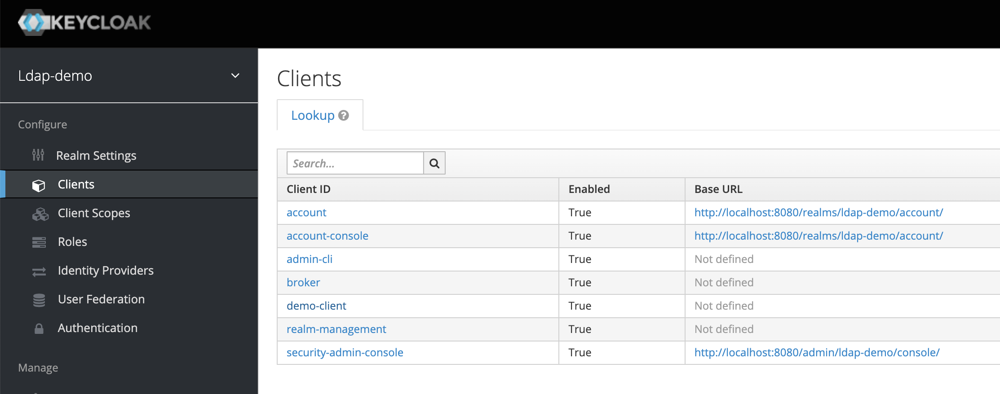

click on demo-client to configure the details, goto Roles tab 


click on `Add Role` button to create a new role
+ Role Name : NORMAL_USER
+ Description : Normal users
+ click Save
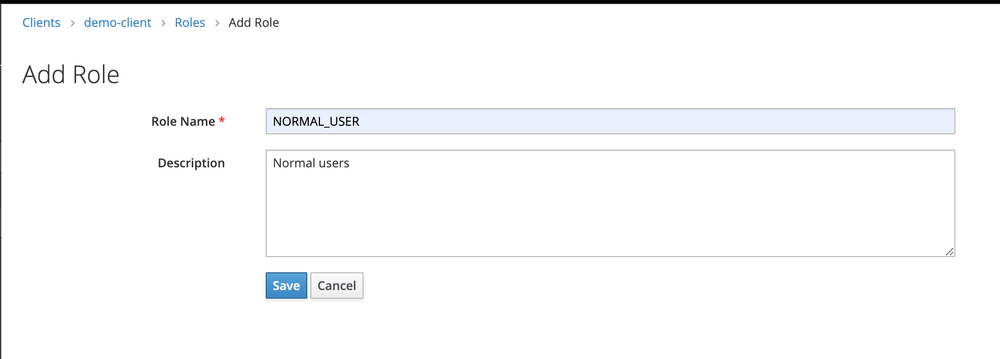

repeat this step to add `SUPER_USER` role 
+ Role Name : SUPER_USER
+ Description : Super users

### synchronize groups from ldap to keycloak
we need to synchronize the user groups from ldap to keycloak at this point

+ click on `User Federation` from the left navigation menu
+ click on `ldap-embedded-server` to see the details
+ click on `Mappers` tab to add a new mapper
+ click on `Create` button 
+ enter following values
  + Name : LDAP Group mapper
  + Mapper Type : group-ldap-mapper
  + LDAP Groups DN : ou=UserRoles,dc=keycloak,dc=org
  + Drop non-existing groups during sync : ON
+ click on `Save` button and then click on `Sync LDAP Groups to Keycloak` button to synch the user groups
+ 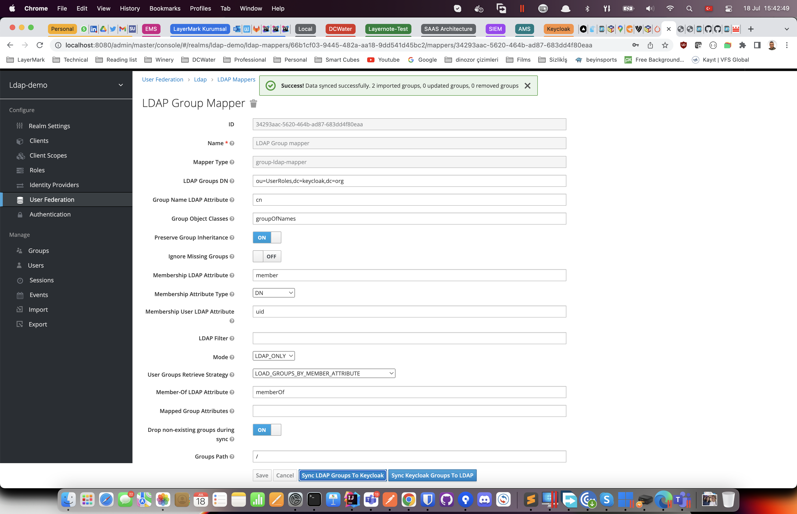
+ verify the user groups imported by clicking Groups from the left navigation pane
+ 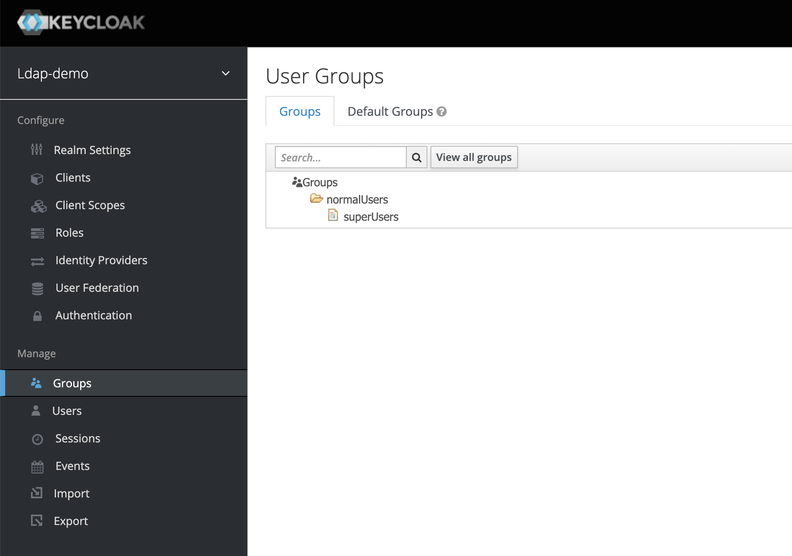
+ verify that `normalUsers` and `superUsers` groups have also members syncyronized from ldap by clicking on the group name and go to `Members` tab.
+ 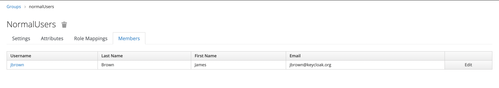
+ 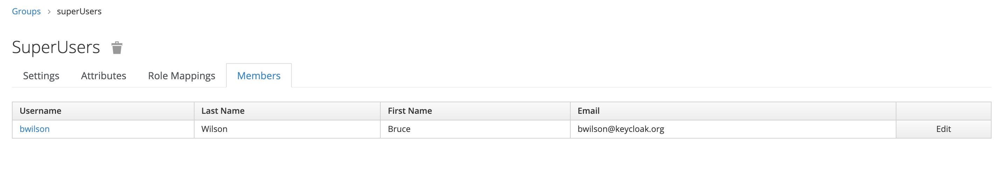

in order to associate client roles to groups, we should do the following steps
+ click on `normalUsers` group from `Groups` tree view
+ go to `Role Mappings` tab
+ from the `Client Roles` dropdown list, select `demo-client` 
+ from the `Available Roles` list select `NORMAL_USER` role and click on `Add selected` button
+ you should see a message indicating the role added to the group's client roles
+ 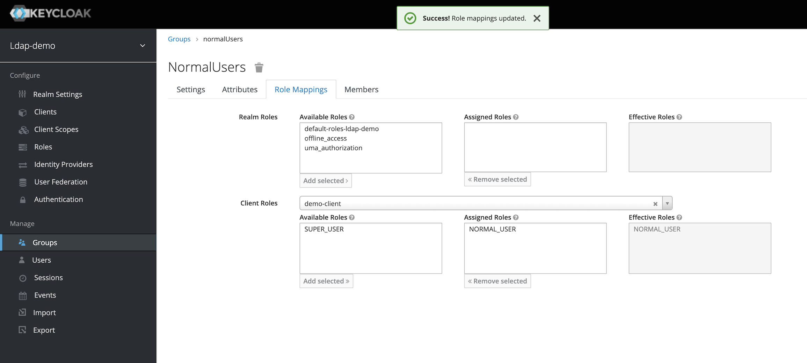

repeat the same steps for `superUsers` group to add `NORMAL_USER` and `SUPER_USER` roles to the superUsers group. 
+ 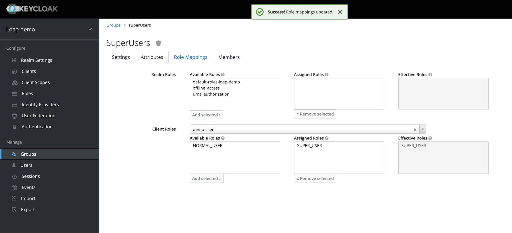

### verify roles in the access token 
from the Postman go to `v18.0 - Authenticate - bwilson - SUPER_USER` request and run it. you will get a JWT token including `SUPER_USER` and `NORMAL_USER` roles. you can see it for yourself by copy pasting the token to jwt.io and decode the token. 
+ 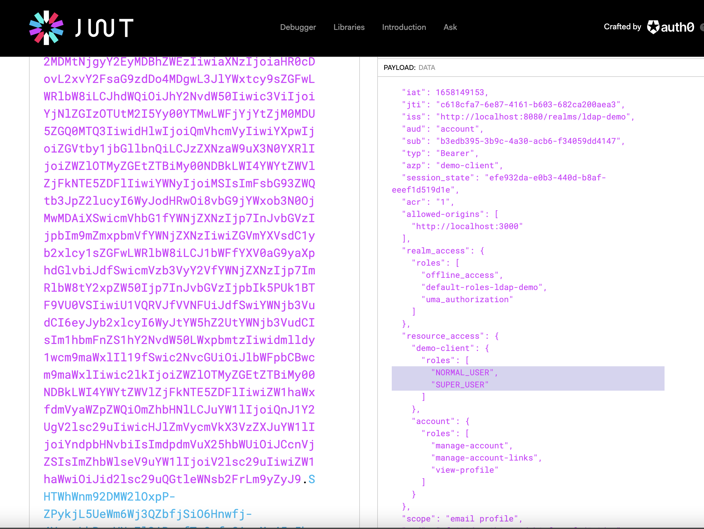

if you authenticate as a NORMAL_USER (jbrown), you should only be able to call following requests
+ GET Auth details - HTTP-200
+ DO Super things - HTTP-403, since jbrown is not a SUPER_USER this service should return HTTP-403
+ DO Normal things - HTTP-200 , jbrown should be enabled to perform this operation 

if you authenticate as a SUPER_USER (bwilson), you should be able to call all the requests
+ GET Auth details - HTTP-200
+ DO Super things - HTTP-200, bwilson is enabled to perform this operation
+ DO Normal things - HTTP-200 , bwilson is enabled to perform this operation 

## 6. frontend vue.js project
In the github repository, we provide the vue.js application under frontend-vuejs folder. we will go over the main parts of the vue.js application and see how it works 

### .env.local 
this file defines the local environment variables and we define the KEYCLOAK related variables here. pay attention the the values which match the values we have configured so far on keycloak side.
```
VUE_APP_KEYCLOAK_API_URL=http://localhost:8080
VUE_APP_KEYCLOAK_REALM=ldap-demo
VUE_APP_KEYCLOAK_CLIENT_ID=demo-client
```

### package.json
pay attention to keycloak.js dependancy and the version mataches with the keycloak server version 18 we use 
```
"dependencies": {
"clipboard": "^2.0.10",
"core-js": "^3.8.3",
"keycloak-js": "^18.0.0",
"mitt": "^3.0.0",
"vue": "^3.2.13",
"vue-axios": "^3.4.1",
"vue3-json-viewer": "^2.1.0"
},
```

### vue.config.json
here we configure a proxy dev server for routing backend requests to our spring boot backend app running at http://localhost:8070
```
module.exports = defineConfig({
  transpileDependencies: true,
  devServer: {
    port: 3000,
    open: true,
    proxy: `http://localhost:8070`
  }
})
```

### main.js
here is the actual integration to keycloak server from the vue.js application. 

```
// KEYCLOAK
const initOptions = {
url: process.env.VUE_APP_KEYCLOAK_API_URL,
realm: process.env.VUE_APP_KEYCLOAK_REALM,
clientId: process.env.VUE_APP_KEYCLOAK_CLIENT_ID
}

const keycloak = Keycloak(initOptions)

keycloak.init({onLoad: 'login-required'}).then(() => {

    store.commit('setUserName',keycloak.tokenParsed.preferred_username)
    store.commit('setKeycloakToken',keycloak.token)
    store.commit('setKeycloakTokenParsed',keycloak.tokenParsed)

    emitter.on('keycloak-logout', () => {
        keycloak.logout()
    })

    // Token Refresh
    setInterval(() => {
        keycloak
            .updateToken(70)
            .then((refreshed) => {
                if (refreshed) {
                    store.commit('setUserName',keycloak.tokenParsed.preferred_username)
                    store.commit('setKeycloakToken',keycloak.token)
                    store.commit('setKeycloakTokenParsed',keycloak.tokenParsed)

                    console.info('Token refreshed' + refreshed)
                } else {
                    console.warn('Token not refreshed, valid for ' + Math.round(keycloak.tokenParsed.exp + keycloak.timeSkew - new Date().getTime() / 1000) + ' seconds')
                }
            })
            .catch(() => {
                keycloak.logout()
            })
    }, 60 * 1000)
})
```
## 7. optional github authentication
if you want to integrate your keyclaok with github as authentication provider, it's quite straight forward to do so. you must have done the application registration on github developer settings as explained in the prerequisites section. you should keep your github client ID and client secret values ready.

the steps to setup github in keycloak is as follows
+ goto keycloak admin console and if required, select ldap-demo 
+ goto Identity Providers from the left navigation menu
+ 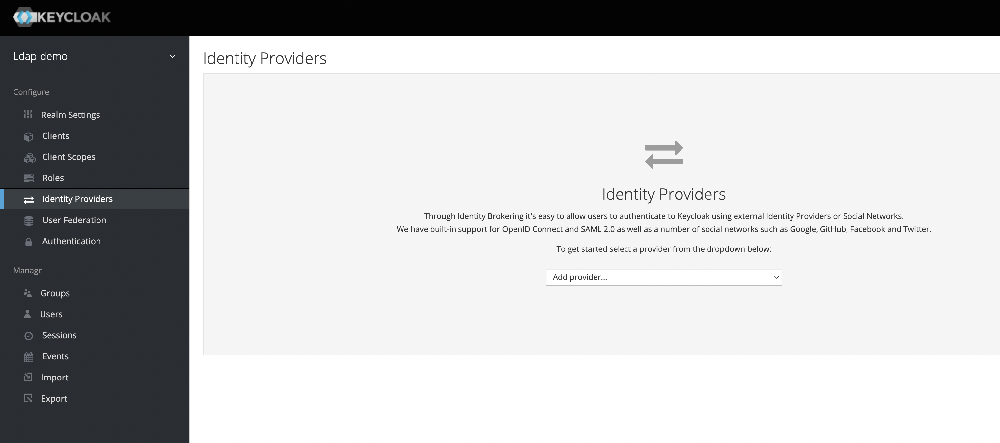
+ select github from the identity providers list to create a new identity provider
+ 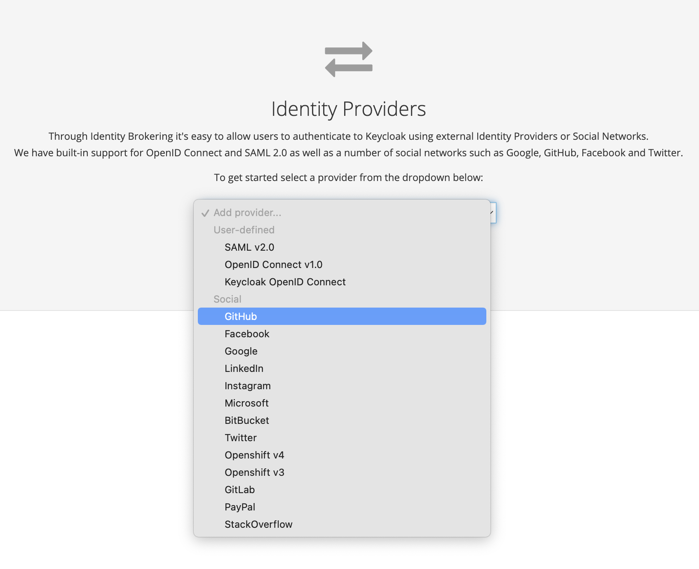
+ Enter following values
  + Client ID : {client ID value that you have acquired from github}
  + Client Secret : {client Secret value that you have acquired from github}
  + click Save
+ that's it, when you try to authenticate from any web application either account app, or our vue.js app you will see two options on the login screen now
+ 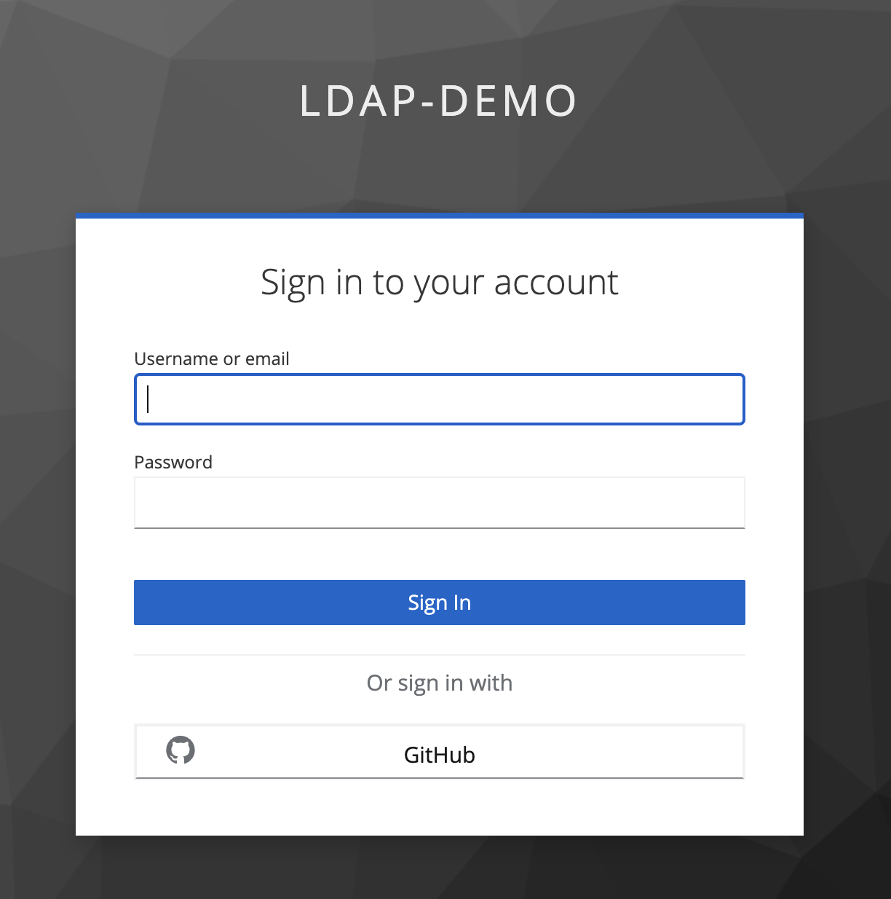

## 8. conclusion
to summarize we have seen completed following operations in the scope of this workshop 
+ run embedded ldap server on local
+ set up keycloak
+ integrate keycloak to work with local embedded ldap server
+ synchronize users from ldap to keycloak
+ authenticat users from keycloak 
+ set up spring security on spring boot backend application to use JWT token acquired from keycloak
+ synchronize groups from ldap to keycloak
+ set up groups to have proper roles
+ verify the access rules based on user roles
+ start vue.js frontend application 
+ verify authentication through keycloak 
+ optional
  + set up github authentication
  + verify authentication via github from vue.js app
